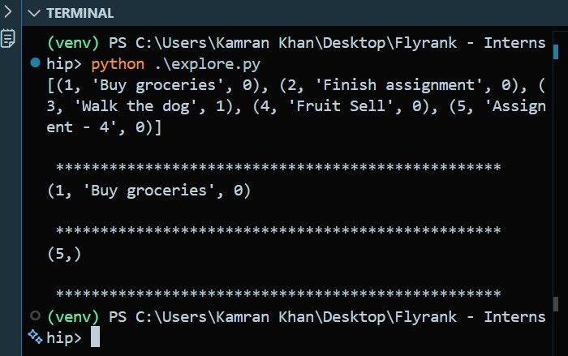

# Flyrank - Internship: Task API

Simple Task API built with FastAPI for creating, reading, updating and deleting tasks, backed by a SQLite database.

## Features
- Persistent task storage using SQLite
- Endpoints: list tasks, add task, get/update/delete by id, health check
- Data survives server restarts

## Requirements
- Python 3.10+ recommended
- See dependency list: [requirmenets.txt](requirmenets.txt)

## Setup
1. Create and activate a virtual environment (Windows PowerShell):

```powershell
python -m venv venv
& venv\Scripts\Activate.ps1
```

2. Install dependencies:

```bash
pip install -r requirmenets.txt
```

## Run
Start the server using Uvicorn (module `server:app`):

```bash
uvicorn server:app --reload --host 0.0.0.0 --port 8000
```

The app file is [server.py](server.py). Default API root is `/` and the tasks resource is `/tasks`.

On first run, the app automatically creates a SQLite database file, `tasks.db`, in the project root, along with a `tasks` table. Three example tasks are inserted only if the table is empty, so restarting the server never duplicates them.

## Database
- **Engine:** SQLite, chosen because it requires no separate database server, stores everything in a single portable file, and is well suited for small projects and local development.
- **Location:** `tasks.db`, created automatically in the project root on first run.
- **Schema:** a single `tasks` table with columns `id` (integer primary key, autoincrement), `title` (text), and `done` (boolean).
- **Viewer used:** [DB Browser for SQLite](https://sqlitebrowser.org/) to inspect and manually query the database during development.

Example query run against the database:

```sql
SELECT * FROM tasks WHERE done = 1;
```

## Endpoints (examples)
- GET / => server metadata
- GET /health => {"status": "ok"}
- GET /tasks => list all tasks (from the database)
- POST /tasks => add a task
  - Body: {"title": "Task title"}
  - Returns: 201 and the created task
- GET /tasks/{id} => get a task
- PUT /tasks/{id} => update a task
  - Body: {"title": "New title", "done": true}
- DELETE /tasks/{id} => remove a task (204)

Validation: creating/updating tasks requires a non-empty `title`.

## Development notes
- Data is stored persistently in `tasks.db` (SQLite) rather than in memory. Restarting the server no longer resets your data.
- The database and table are created automatically if missing — no manual setup required.
- For production, consider migrating to a more robust database engine (PostgreSQL, MySQL, etc.) and adjust CORS/security as needed. The API layer would not need to change to support this.

## License
This repository does not include a license file. Add one if you plan to publish or share publicly.

## Contact
If you need changes or additional docs, open an issue or contact the project maintainer.

## Database Screenshot
